# Lab4Web
## Praktikum 4 : CSS Layout

### Langkah-Langkah Praktikum
Persiapan membuat dokumen HTML dengan nama file lab4_box.html seperti berikut.

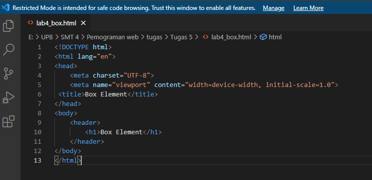

### Membuat Box Element
Kemudian tambahkan kode untuk membuat box element dengan tag div seperti berikut.

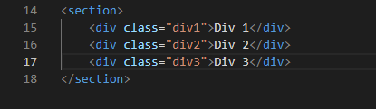

Buka browser untuk melihat hasilnya.

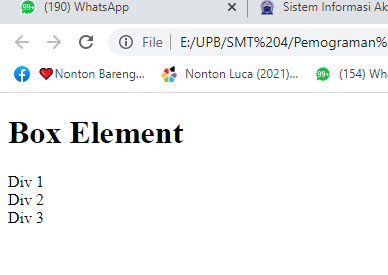

### CSS Float Property
Selanjutnya tambahkan deklarasi CSS pada head untuk membuat float element, seperti berikut.

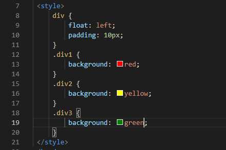

Buka browser untuk melihat perubahannya.

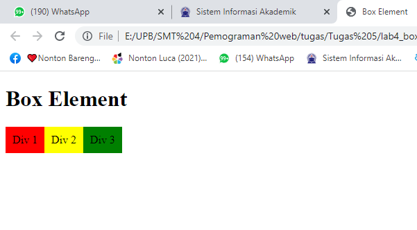

### Mengatur Clearfix Element
Clearfix digunakan untuk mengatur element setelah float element. Property clear digunakan untuk mengaturnya.
Tambahkan element div lainnya seteleah div3 seperti berikut.

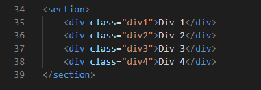

Kemudian atur property clear pada CSS, seperti berikut.

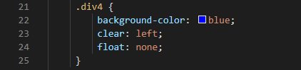

Selanjutnya buka browser dan refresh kembali, lihat perubahannya.

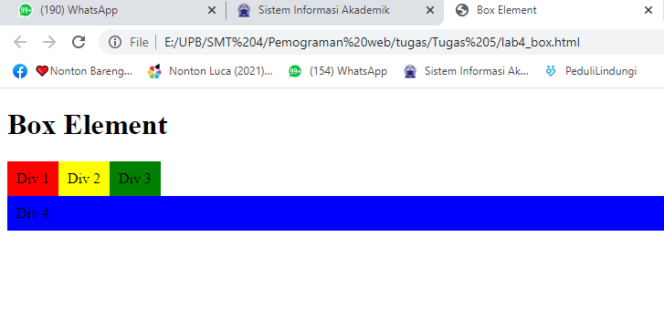

Lakukan eksperimen terhadap penggunaan property clear dengan nilai lainnya (left, both, right),
dan amati perubahannya.

Berikut ini contoh penggunaan property clear right.

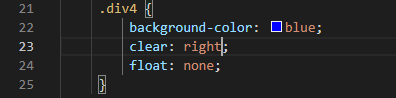

Refresh browser untuk melihat perubahannya.

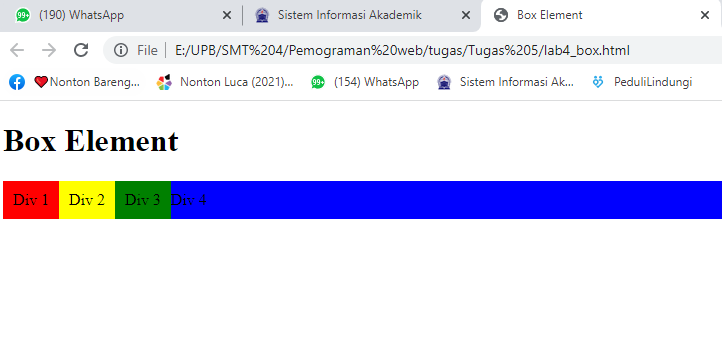

Berikut ini contoh penggunaan property clear both.

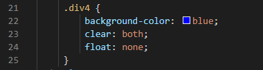

Refresh browser untuk melihat perubahannya.

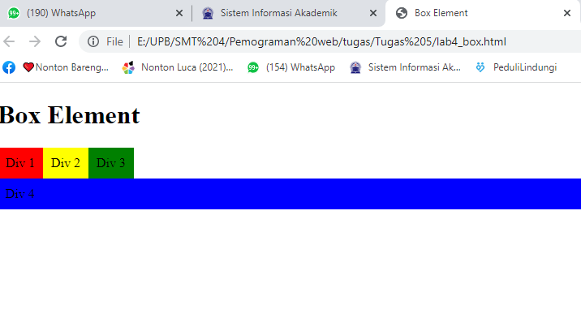

### Membuat Layout Sederhana
Buat folder baru dengan nama lab4_layout, kemudian buatlah file baru didalamnya dengan nama
home.html, dan file css dengan nama style.css.

Kemudian buat kerangka layout dengan semantics element seperti berikut.
`<header>`
`<nav>`
`<section id="hero">`
`<section id="wrapper">`
`<section id="main">`
`<aside id="sidebar">`
`<footer>`

Tuliskan kode berikut ini.

