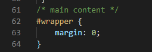

# Lab4Web
## Praktikum 4 : CSS Layout

### Langkah-Langkah Praktikum
Persiapan membuat dokumen HTML dengan nama file lab4_box.html seperti berikut.

### Membuat Box Element
Kemudian tambahkan kode untuk membuat box element dengan tag div seperti berikut.

Buka browser untuk melihat hasilnya.

### CSS Float Property
Selanjutnya tambahkan deklarasi CSS pada head untuk membuat float element, seperti berikut.

Buka browser untuk melihat perubahannya.

### Mengatur Clearfix Element
Clearfix digunakan untuk mengatur element setelah float element. Property clear digunakan untuk mengaturnya.
Tambahkan element div lainnya seteleah div3 seperti berikut.

Kemudian atur property clear pada CSS, seperti berikut.

Selanjutnya buka browser dan refresh kembali, lihat perubahannya.

Lakukan eksperimen terhadap penggunaan property clear dengan nilai lainnya (left, both, right),
dan amati perubahannya.

Berikut ini contoh penggunaan property clear right.

Refresh browser untuk melihat perubahannya.

Berikut ini contoh penggunaan property clear both.

Refresh browser untuk melihat perubahannya.

### Membuat Layout Sederhana
Buat folder baru dengan nama lab4_layout, kemudian buatlah file baru didalamnya dengan nama
home.html, dan file css dengan nama style.css.

Kemudian buat kerangka layout dengan semantics element seperti berikut.
`<header>`
`<nav>`
`<section id="hero">`
`<section id="wrapper">`
`<section id="main">`
`<aside id="sidebar">`
`<footer>`

Tuliskan kode berikut ini.

Kemudian buka browser dan lihat hasilnya.

Kemudian tambahkan kode CSS untuk membuat layoutnya.

Kemudian lihat hasilnya pada browser.

### Membuat Navigasi
Kemudian selanjutnya mengatur navigasi.

Kemudian lihat hasilnya.

### Membuat Hero Panel.
Selanjutnya membuat hero panel. Tambahkan kode HTML dan CSS seperti berikut.

Kemudian lihat hasilnya.

### Mengatur Layout Main dan Sidebar
Selanjutnya mengatur main content dan sidebar, tambahkan CSS float.

### Membuat Sidebar Widget
Kemudian selanjutnya menambahkan element lain dalam sidebar. 

Kemudian tambahkan CSS.

Kemudian lihat hasilnya.

### Mengatur Footer
Selanjutnya mengatur tampilan footer. Tambahkan CSS untuk footer.

Kemudian lihat hasilnya.

### Menambahkan Elemen lainnya pada Main Content

Kemudian tambahkan CSS.

Lihat hasilnya dibrowser.

### Menambahkan Content Artikel
Selanjutnya membuat content artikel. Tambahkan HTML berikut pada main content.

Kemudian tambahkan CSS.

Lihat hasilnya dibrowser.

### Tambahan Layout untuk menu About
=> Membuat single layout yang berisi deskripsi perkenalan.
Buatlah codingan seperti berikut ini.

Kemudian tambahkan CSS.

Lihat hasilnya dibrowser.

### Tambahan Layout untuk menu Contact
=> yang berisi form isian: nama, email, message, dll
Buatlah codingan seperti berikut ini.

Kemudian tambahkan CSS.

Lihat hasilnya dibrowser.

